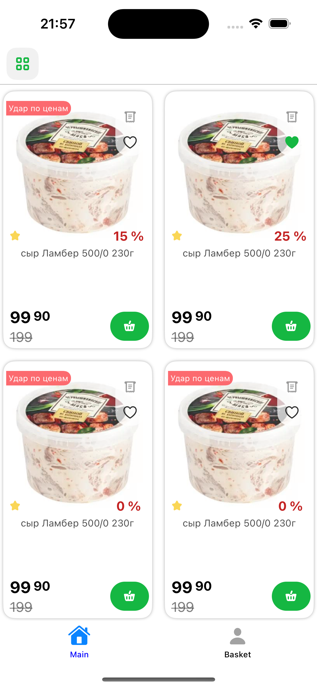
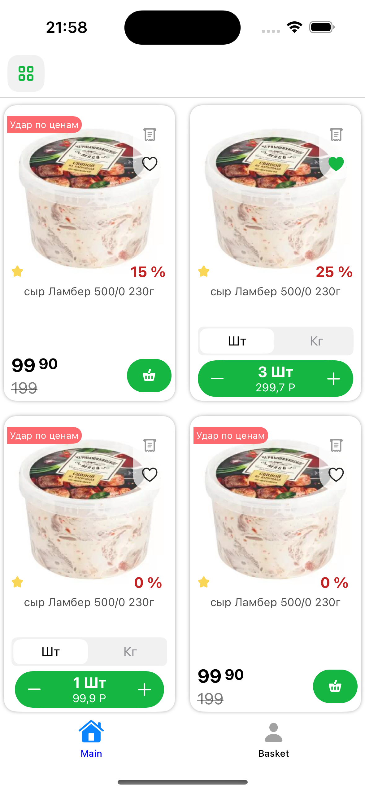
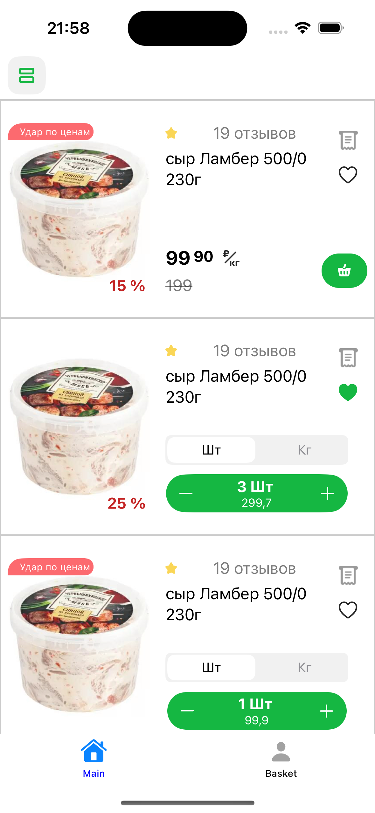
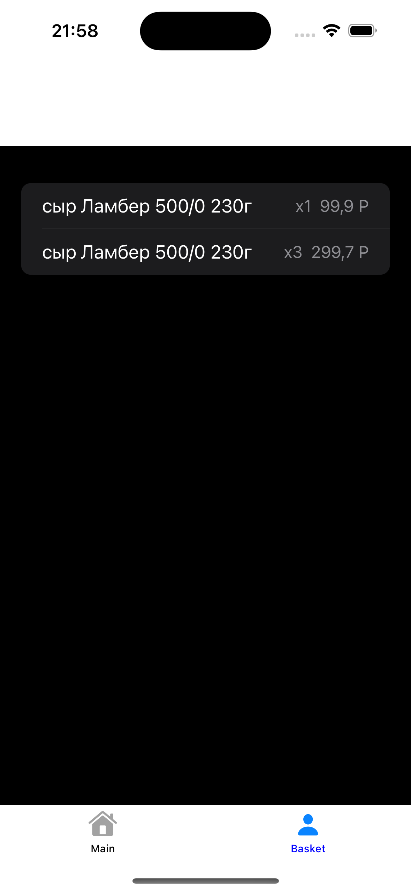

# Test Vacc Spar

## Обзор

**Test Vacc Spar** — это приложение на SwiftUI, предназначенное для демонстрации каталога товаров с функцией корзины покупок.
 В приложении пользователи могут просматривать товары в сеточном или списочном виде, добавлять товары в корзину и просматривать содержимое своей корзины.

## Функции

- **Каталог товаров**: Просмотр товаров в виде сетки или списка.
- **Управление корзиной**: Добавление или удаление товаров из корзины.
- **Динамический интерфейс**: Переключение между видами сетки и списка.
- **Детали товара**: Просмотр рейтингов товаров, скидок и количеств.

## Скриншоты







## Используемые технологии

- **SwiftUI**: Для создания пользовательского интерфейса.
- **Combine**: Для реактивного программирования и управления данными.
- **MVVM Паттерн**: Для организации кода и разделения ответственности.

## Установка

Чтобы начать работу с этим проектом, выполните следующие шаги:

1. **Клонируйте репозиторий**

    ```bash
    git clone https://github.com/ваш-логин/test-vacc-spar.git
    ```

2. **Откройте проект**

    Откройте проект в Xcode:

    ```bash
    open test-vacc-spar.xcodeproj
    ```

3. **Соберите и запустите**

    Выберите целевое устройство или симулятор и нажмите кнопку "Run" в Xcode.

## Использование

1. **Основной экран**: Переключайтесь между видами сетки и списка для просмотра каталога товаров.
2. **Действия с товарами**: Добавляйте товары в корзину, используя кнопку "+". Изменяйте количество товаров и наблюдайте обновления в реальном времени.
3. **Экран корзины**: Получите доступ к корзине, чтобы просмотреть товары, количества и общую стоимость.

## Структура кода

- **`MainView.swift`**: Основной вид, отображающий каталог товаров.
- **`GridProductCardView.swift`**: Вид для отображения отдельных товаров в сетке.
- **`ListProductCardView.swift`**: Вид для отображения отдельных товаров в списке.
- **`BasketView.swift`**: Вид корзины с возможностью просмотра и управления товарами.
- **`BasketViewModel.swift`**: Модель представления корзины для управления состоянием и логикой корзины.
- **`ProductModel.swift`**: Модель данных товара.
